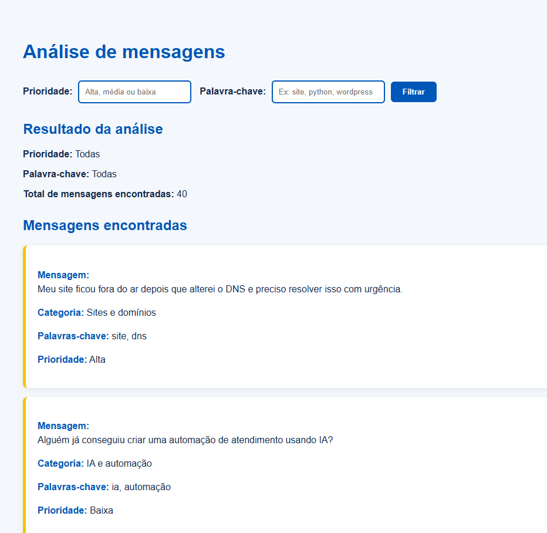

# 📊 HostGator Message Analytics Dashboard | Code For Real

> 🏆 Desenvolvido durante a imersão **Code For Real - UniSENAI** (08/08/2026), com desafio proposto pela **HostGator**.

---

## 📸 Prévia da Aplicação

> Painel web interativo para filtragem, contagem e classificação de mensagens de comunidade de tecnologia.

  

---

## 💡 Sobre o Desafio
O objetivo da imersão foi criar uma aplicação web capaz de processar um conjunto anonimizado de mensagens de uma comunidade de tecnologia (`mensagens_desafio_hostgator.json`) e transformá-lo em um painel gerencial claro e funcional.

A solução processa os dados de forma automatizada utilizando regras lógicas e listas de palavras-chave, sem dependência de inteligência artificial ou banco de dados externo.

## ✨ Principais Funcionalidades (Requisitos Atendidos)
* 📥 **Leitura de Dados:** Processamento direto do arquivo JSON estruturado.
* 🏷️ **Classificação por Temática:** Organização automática das mensagens em categorias como *Sites e Domínios, Hospedagem e Servidores, WordPress, E-mail, IA e Automação, Programação*, entre outras.
* 🚦 **Gestão de Prioridades:** Identificação inteligente de graus de urgência (*Alta, Média e Baixa*) com base em termos críticos e regras de precedência.
* 🔍 **Filtros Dinâmicos:** Opção de buscar por prioridade e palavra-chave na interface.
* 📊 **Painel de Indicadores:** 
  * Total de mensagens analisadas.
  * Contagem por nível de prioridade e por categoria.
  * Identificação do principal assunto recorrente e ranking geral.
  * Exibição detalhada das mensagens originais com suas respectivas categorias e prioridades.

## 🧰 Tecnologias Utilizadas
* **HTML5, CSS3 & JavaScript (ES6+)**
* **Lógica baseada em Regras Condicionais e Manipulação de Arrays/JSON**
* **Interface Responsiva**
